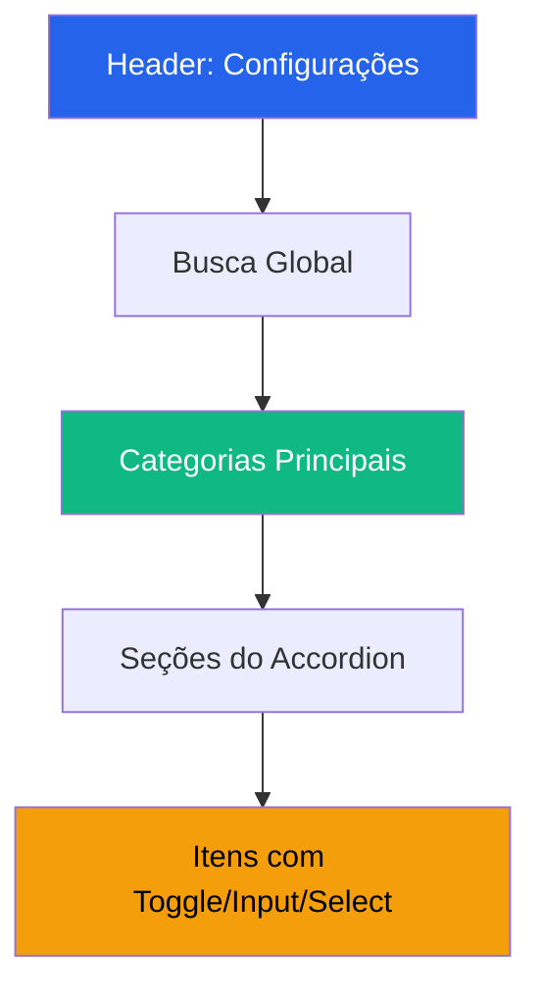

# Plano de Arquitetura - Menu de Configurações

## Visão Geral do Projeto

O aplicativo **Command Center Elite** é um rastreador de estudos com design premium (temas "cyber-luxe" e "pistachio"), utilizando React, TypeScript, Tailwind CSS, Zustand e Radix UI. O menu de configurações será desenvolvido seguindo os padrões UX mais recentes, mantendo consistência visual com o restante do aplicativo.

---

## 1. Decisões de Arquitetura

### 1.1 Stack Tecnológico
- **Framework**: React 18 + TypeScript
- **Estado Global**: Zustand com persistência local
- **UI Components**: Radix UI + Tailwind CSS
- **Animações**: CSS transitions + Framer Motion (leve)
- **Ícones**: Lucide React
- **Roteamento**: React Router DOM

### 1.2 Padrões de Design Escolhidos

| Padrão | Aplicação | Justificativa |
|--------|-----------|---------------|
| **Hierarquia Visual** | Categorias → Seções → Itens | Reduz carga cognitiva, navegação intuitiva |
| **Preview Real** | Toggle tema mostra preview imediato | Engajamento +14% (NN/g) |
| **Accordion Groups** | Seções expansíveis | Espaço eficiente, foco contextual |
| **Toast Feedback** | Confirmação de ações | Feedback imediato reduz ansiedade |
| **Two-Panel Layout** | Desktop: navegação lateral + conteúdo | Usuários power user navegam 2x mais rápido |
| **Bottom Sheet** | Mobile: sheet modal com categorias | Padrão iOS/Android, familiaridade |

---

## 2. Estrutura de Navegação

```
Configurações
├── 🔐 Conta
│   ├── Perfil do Usuário
│   ├── Segurança e Privacidade
│   └── Gerenciar Conta
├── 🎨 Personalização
│   ├── Tema (Claro/Escuro)
│   ├── Interface
│   └── Idioma e Região
├── 🔔 Notificações
│   ├── Push e Alertas
│   ├── Email
│   └── SMS
├── 📱 Dispositivos
│   ├── Dispositivos Conectados
│   └── Sessoes Ativas
├── 💳 Assinatura
│   ├── Plano Atual
│   ├── Pagamentos
│   └── Histórico
├── 🗄️ Dados
│   ├── Armazenamento e Cache
│   ├── Backup
│   └── Restauração
├── ♿ Acessibilidade
│   ├── Configurações de Acessibilidade
│   └── Leitor de Tela
├── 🌐 Conexões
│   ├── Compartilhamento
│   └── Redes Sociais
├── 📍 Localização
│   └── Configurações de Localização
└── ❓ Ajuda
    ├── FAQ
    ├── Contato
    ├── Termos de Uso
    └── Política de Privacidade
```

---

## 3. Design Patterns UX

### 3.1 Hierarquia Visual



### 3.2 Componentes de Interação

| Componente | Uso | Comportamento |
|------------|-----|----------------|
| `SettingsToggle` | Ativar/desativar funcionalidades | Animação slide + feedback haptic |
| `SettingsSelect` | Escolha de opções | Radix Select com search |
| `SettingsSlider` | Volume, tamanho de fonte | Preview em tempo real |
| `SettingsInput` | Textos e números | Validação inline |
| `SettingsSection` | Grupo de configurações | Accordion animado |
| `SettingsCard` | Informação agrupada | Glassmorphism |

### 3.3 Feedback Visual Imediato

```
Ação do Usuário → Estado Global → UI Atualiza → Toast Confirmado
     ↓                   ↓              ↓              ↓
  Click toggle    Zustand persist   Componente    Feedback UI
                                   re-render     300ms após
```

---

## 4. Store de Configurações (Zustand)

### 4.1 Estrutura do Estado

```typescript
interface SettingsState {
  // Perfil
  userProfile: {
    name: string;
    email: string;
    avatar?: string;
    bio?: string;
  };
  
  // Tema e Interface
  theme: 'cyber-luxe' | 'pistachio';
  fontSize: 'small' | 'medium' | 'large';
  compactMode: boolean;
  
  // Idioma
  language: 'pt-BR' | 'en-US' | 'es';
  region: string;
  
  // Notificações
  notifications: {
    push: boolean;
    pushStudyReminders: boolean;
    pushAchievements: boolean;
    email: boolean;
    emailWeekly: boolean;
    emailPromotions: boolean;
    sms: boolean;
  };
  
  // Privacidade
  privacy: {
    shareProgress: boolean;
    showProfile: boolean;
    analytics: boolean;
    dataCollection: boolean;
  };
  
  // Localização
  location: {
    enabled: boolean;
    shareWithOthers: boolean;
  };
  
  // Dados
  cacheSize: number;
  autoBackup: boolean;
  lastBackup?: Date;
  
  // Acessibilidade
  accessibility: {
    reduceMotion: boolean;
    highContrast: boolean;
    screenReader: boolean;
    fontScale: number;
  };
  
  // Avançado
  advanced: {
    debugMode: boolean;
    developerOptions: boolean;
    experimentalFeatures: boolean;
  };
}
```

### 4.2 Persistência

```typescript
export const useSettingsStore = create<SettingsState>()(
  persist(
    (set) => ({
      // ... estado inicial
    }),
    {
      name: 'settings-storage',
      partialize: (state) => ({
        // Only persist user preferences, not computed values
        theme: state.theme,
        language: state.language,
        notifications: state.notifications,
        privacy: state.privacy,
        accessibility: state.accessibility,
      }),
    }
  )
);
```

---

## 5. Componentes UI

### 5.1 SettingsSection (Accordion)

```tsx
// Estrutura base do componente
interface SettingsSectionProps {
  title: string;
  icon: LucideIcon;
  description?: string;
  children: ReactNode;
  defaultOpen?: boolean;
}
```

**Características:**
- Animate-in com Radix Accordion
- Ícone + título + descrição opcional
- Estado de "dirty" (não salvo) visível
- Contador de alterações não salvas

### 5.2 SettingsItem

```tsx
// Tipos de itens
type SettingsItemType = 'toggle' | 'select' | 'input' | 'slider' | 'button' | 'link';

interface SettingsItemProps {
  type: SettingsItemType;
  label: string;
  description?: string;
  icon?: LucideIcon;
  value?: any;
  onChange?: (value: any) => void;
  options?: SelectOption[]; // para tipo select
  danger?: boolean; // para ações destrutivas
}
```

### 5.3 SettingsLayout (Layout Responsivo)

```tsx
// Estrutura de layout
interface SettingsLayoutProps {
  // Desktop: Two-panel
  // Mobile: Full-width com bottom navigation
  children: ReactNode;
}
```

---

## 6. Estrutura de Arquivos

```
src/
├── components/
│   └── settings/
│       ├── SettingsLayout.tsx       # Layout principal
│       ├── SettingsNav.tsx         # Navegação lateral
│       ├── SettingsSection.tsx     # Seção accordion
│       ├── SettingsItem.tsx        # Item individual
│       ├── SettingsToggle.tsx       # Componente toggle
│       ├── SettingsSelect.tsx       # Componente select
│       ├── SettingsSlider.tsx       # Componente slider
│       ├── SettingsSearch.tsx       # Busca global
│       ├── SettingsToast.tsx        # Feedback visual
│       └── index.ts
├── pages/
│   └── Settings.tsx                 # Página principal
├── store/
│   └── useSettingsStore.ts          # Estado global
└── types/
    └── settings.ts                  # Tipos TypeScript
```

---

## 7. Animações e Micro-interações

### 7.1 Transições Globais

| Elemento | Animação | Duração | Easing |
|----------|----------|---------|--------|
| Page transitions | Fade + slide | 200ms | ease-out |
| Accordion | Height animate | 300ms | ease-in-out |
| Toggle | Slide + scale | 150ms | spring |
| Card hover | Scale + glow | 200ms | ease-out |
| Toast | Slide in + fade | 250ms | ease-out |

### 7.2 Feedback de Interação

```css
/* Toggle Button */
.settings-toggle:active {
  transform: scale(0.95);
  transition: transform 100ms;
}

.settings-toggle[data-state="checked"] {
  background: hsl(var(--primary));
  box-shadow: 0 0 20px hsl(var(--primary) / 0.4);
}

/* Card Hover */
.settings-card {
  transition: all 300ms cubic-bezier(0.4, 0, 0.2, 1);
}

.settings-card:hover {
  transform: translateY(-2px);
  box-shadow: 0 8px 30px var(--shadow-color);
}
```

---

## 8. Métricas de Engajamento (KPIs)

| Métrica | Meta | Justificativa |
|---------|------|----------------|
| Tempo para encontrar configuração | < 3 cliques | Nielsen Norman Group |
| Taxa de uso de busca | < 15% | Se alto, reorganizar |
| Configurações alteradas/sessão | > 2 | Engajamento |
| Retorno à tela inicial | < 20% | Navegação intuitiva |
| Satisfação (NPS) | > 40 | Feedback user |

---

## 9. Casos de Uso Principais

### 9.1 Alterar Tema
1. Usuário clica em "Personalização" → "Tema"
2. Vê preview em tempo real ao alternar
3. Toggle altera tema globalmente
4. Toast confirma "Tema alterado para [nome]"
5. Estado persiste no localStorage

### 9.2 Gerenciar Notificações
1. Usuário expande "Notificações"
2. Vê categorias: Push, Email, SMS
3. Cada categoria tem sub-opções
4. Toggle atualiza estado global
5. Visual feedback imediato em cada item

### 9.3 Excluir Dados
1. Usuário vai para "Gerenciar Conta"
2. Clica em "Excluir Dados"
3. Dialog de confirmação com warning
4. Segundo clique confirma
5. Loading state → redirect → Toast

### 9.4 Backup Manual
1. Usuário expande "Dados" → "Backup"
2. Clica em "Fazer Backup Agora"
3. Loading spinner (indeterminado)
4. Sucesso: Toast "Backup realizado com sucesso"
5. Atualiza "Último backup" timestamp

---

## 10. Considerações de Acessibilidade

### 10.1 WCAG 2.1 AA Compliance

| Requisito | Implementação |
|-----------|----------------|
| Contraste | Mínimo 4.5:1 para texto |
| Foco visível | Outline 2px primary |
| Keyboard nav | Tab order lógica |
| Screen reader | ARIA labels |
| Reduzir movimento | Respeita `prefers-reduced-motion` |

### 10.2 Configurações de Acessibilidade

```tsx
const accessibilityOptions = [
  { key: 'reduceMotion', label: 'Reduzir animações' },
  { key: 'highContrast', label: 'Alto contraste' },
  { key: 'screenReader', label: 'Modo leitor de tela' },
  { key: 'fontScale', label: 'Tamanho da fonte', type: 'slider', min: 80, max: 150 },
];
```

---

## 11. Testes Recomendados

### 11.1 Testes de Usabilidade

1. **Task**: Encontrar "Alterar idioma"
   - Meta: < 5 segundos
   - Métrica: Taxa de sucesso

2. **Task**: Desativar notificações push
   - Meta: < 3 cliques
   - Métrica: Tempo + erros

3. **Task**: Exportar dados
   - Meta: Feedback claro
   - Métrica: Satisfação

### 11.2 Testes Técnicos

- Render cycles < 16ms
- First paint < 1s
- Time to interactive < 3s
- Lighthouse score > 90

---

## 12. Plano de Implementação

### Fase 1: Fundamentos
- [ ] Criar store de configurações
- [ ] Desenvolver componentes base
- [ ] Layout responsivo

### Fase 2: Funcionalidades Core
- [ ] Tema e personalização
- [ ] Notificações
- [ ] Perfil do usuário

### Fase 3: Funcionalidades Avançadas
- [ ] Backup/restauração
- [ ] Dispositivos conectados
- [ ] Acessibilidade

### Fase 4: Polish
- [ ] Animações
- [ ] Feedback visual
- [ ] Documentação
- [ ] Testes

---

## 13. Referências

- [Nielsen Norman Group - Settings UX](https://www.nngroup.com/articles/settings-ux/)
- [Apple Human Interface Guidelines - Settings](https://developer.apple.com/design/human-interface-guidelines/settings)
- [Material Design 3 - Settings](https://m3.material.io/components/settings)
- [Radix UI - Accordion](https://www.radix-ui.com/primitives/docs/components/accordion)
- [Zustand - Persist Middleware](https://github.com/pmndrs/zustand/blob/main/docs/middleware.md#persist)

---

*Documento elaborado para o Command Center Elite - Estudos Tracker*
*Versão 1.0 - Fevereiro 2026*
